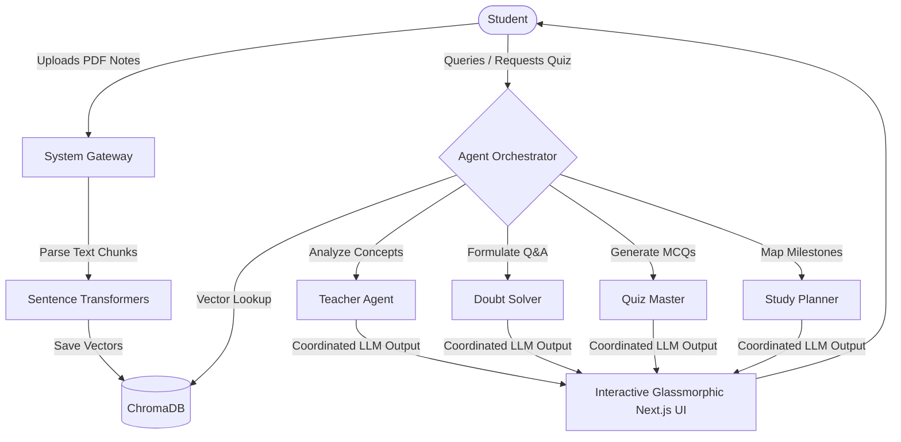

# 🎓 EduAgent — Cooperative Multi-Agent AI Learning Suite

[](https://nextjs.org/)
[](https://fastapi.tiangolo.com/)
[](https://www.docker.com/)
[](https://www.trychroma.com/)
[](https://www.langchain.com/)

**EduAgent** is a production-grade, containerized multi-agent learning platform that transforms dense study materials (lecture slides, notes, and textbooks) into interactive, personalized educational pathways. By coordinating a cooperative swarm of specialized AI agents, the platform constructs concept mind maps, generates adaptive practice quizzes, designs day-by-day study calendars, and answers complex queries with precise citations.

---

## 🧠 AI & Machine Learning Implementation

EduAgent leverages state-of-the-art Natural Language Processing (NLP) and Retrieval-Augmented Generation (RAG) paradigms:

*   **Vector Embeddings & Semantic Search**: Uses the SentenceTransformers model (`all-MiniLM-L6-v2`) to translate raw PDF text chunks into 384-dimensional dense vectors.
*   **Vector Database (ChromaDB)**: Indices and query embeddings with filter options (e.g., subject-grounding metadata) for low-latency semantic chunk retrieval.
*   **Retrieval-Augmented Generation (RAG)**: Connects retrieved knowledge chunks directly to LLM prompts, ensuring answers from the Doubt Solver are grounded in the student's materials.
*   **Multi-Model LLM Orchestration**:
    *   **Groq API (Llama 3.3 70B)**: Serves low-latency subjective and multiple-choice quiz questions, adapting difficulty (Beginner, Intermediate, Advanced) based on user score metrics.
    *   **Google Gemini API**: Utilized for parsing layouts and rendering study-mastery analytics profiles.

---

## 🤖 The Cooperative Agent Swarm

The workspace coordinates four autonomous agents to optimize academic performance:

*   **👨‍🏫 Teacher Agent**: Analyzes uploaded document files, extracts core concepts, structures definitions, and compiles real-world study guides.
*   **💬 Doubt Solver**: Answers student queries, retrieving context from the vector database and citing original source documents with inline footnotes.
*   **📝 Quiz Generator**: Formulates personalized, multiple-choice practice quizzes that scale in difficulty based on performance logs.
*   **📅 Study Planner**: Generates calendar roadmaps mapping milestones from study topics directly to your exam date.

---

## 🛠️ Architecture & Workflow



---

## 🐳 Docker Containerization

The stack is fully containerized using a production-ready **Docker Compose** orchestrator:

*   **Backend Container**: A Debian-slim python image optimized for running web-services and hosting vector calculations. Baked with custom C-libraries (`libgomp1`) for running heavy ML routines. Exposes port `8000`.
*   **Frontend Container**: Utilizes a Node-alpine builder stage and multi-stage runner to isolate Next.js standalone build outputs, minimizing the final production image size. Exposes port `3000`.
*   **Nginx Proxy Container**: Orchestrates incoming traffic on port `80`, routing requests starting with `/api/` directly to the FastAPI container, and all other routes to the Next.js container inside an isolated bridge network (`eduagent-net`).
*   **Persistent Storage Volumes**: Uses a persistent Docker volume (`eduagent_data`) to prevent user account SQLite records and vector indexing databases from being wiped on container rebuilds.

---

## ⚡ Tech Stack

*   **Frontend**: Next.js 16 (App Router), TypeScript, Vanilla CSS Glassmorphism, HTML5 Canvas (physics-drawn mindmap graphs).
*   **Backend**: FastAPI, LangChain, SQLAlchemy, Pydantic, SQLite.
*   **Deployment**: Vercel (Frontend Global Edge Routing) & DigitalOcean (Backend Droplet with Let's Encrypt SSL Nginx Reverse-Proxy).

---

## 🚀 Local Development Setup

### Prerequisites
*   Node.js (v20+)
*   Python (3.11+)
*   Docker & Docker Compose (optional)

### Backend Setup
1. Navigate to the backend directory:
   ```bash
   cd backend
   ```
2. Create your local environment file:
   ```bash
   cp .env.example .env
   ```
3. Populate your `.env` with your API keys.
4. Create a virtual environment and install dependencies:
   ```bash
   python -m venv .venv
   source .venv/bin/activate  # On Windows: .venv\Scripts\activate
   pip install -r requirements.txt
   ```
5. Start the FastAPI server:
   ```bash
   uvicorn app.main:app --reload --host 127.0.0.1 --port 8000
   ```

### Frontend Setup
1. Navigate to the frontend directory:
   ```bash
   cd ../frontend
   ```
2. Create your local environment file:
   ```bash
   echo "NEXT_PUBLIC_API_URL=http://127.0.0.1:8000" > .env.local
   ```
3. Install dependencies:
   ```bash
   npm install
   ```
4. Start the Next.js development server:
   ```bash
   npm run dev
   ```
5. Open [http://localhost:3000](http://localhost:3000) in your browser.

---

## 🐳 Docker Deployment (Full Stack)
To build and run the entire system with Docker Compose:
```bash
docker-compose up --build
```
Once initialized, visit [http://localhost](http://localhost).

---

## 🔒 Production Operations
For detailed guides on production environments (e.g., Vercel + DigitalOcean Droplet with SSL certificates, database backups, and environment configs), refer to the **[DEPLOYMENT.md](DEPLOYMENT.md)** runbook.
